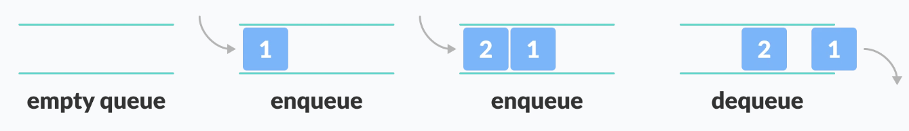

# **Queue (FIFO - First in First Out)**
- It is an opposite of stack.


<p align="center">

</p>

</br>

## **Applications**

 - **General Applications**
    - It is important for UI (event/ message queues)
    - Networking (Tx, Rx packet queues)
    - When data is transferred asynchronously between two processes.The queue is used for synchronization. For example: IO Buffers, pipes, file IO etc.
    - Print spooling in computer systems.
    - Call Center phone systems use Queues to hold people calling them in order.
    - CPU scheduling, Disk Scheduling.


</br>

- **Embedded System Applications**
    - Implementing a message queue for inter-task communication in RTOS.
    - Buffering incoming data from sensors or peripherals in a microcontroller.
    - Managing task scheduling in RTOS.
    - Implementing a queue-based scheduler for real-time systems.
    - Implementing a circular buffer for managing data samples in a data acquisition system.
    - Managing the flow of data between different stages of a signal processing pipeline.

</br>

## **Asymptotic Analysis**

```
    ╔══════════════════════╦═════════╦═════════╦══════╦══════════════════╗
    ║ Queue Implementation ║ Enqueue ║ Dequeue ║ Peek ║ Space Complexity ║
    ╠══════════════════════╬═════════╬═════════╬══════╬══════════════════╣
    ║ Array                ║ O(1)    ║ O(n)    ║ O(1) ║ O(n)             ║
    ╠══════════════════════╬═════════╬═════════╬══════╬══════════════════╣
    ║ Linked List          ║ O(1)    ║ O(1)    ║ O(1) ║ O(n)             ║
    ╠══════════════════════╬═════════╬═════════╬══════╬══════════════════╣
    ║ Deletion             ║ O(1)    ║ O(n)    ║      ║                  ║
    ╚══════════════════════╩═════════╩═════════╩══════╩══════════════════╝
```

</br>

## **Queue Implementation**

- ### **Initialize Queue**

    - We need to define the size of the queue at compile time `BUFF_SIZE`.
    - We need to track the `front` and `count/rear` for the `enq` and `deq` for the array implmentation.

        ```C
            /*------Array Implementation--------*/
            #include <stdio.h>
            #define BUFF_SIZE 3

            int qbuff[BUFF_SIZE], front = 0, count = 0;
        ```

    </br>

    - `qbuff` is similar to `head` in a linked list which stores the start of the linked list.
    - `rear` is tracking the end of the linked list.

        ```C
            /*------Linked List Implementation--------*/
            #include <stdio.h>
            #include <stdlib.h>

            struct qnode
            {
                int data;
                struct qnode *next;
            };
            struct qnode *qbuff = NULL;
            struct qnode *rear = NULL;      // No need to track front
        ```
</br>

- ### **`enqueue()`**
    - `(front + count) % BUFF_SIZE` prevents the queue to write outside the specified size of the queue.
    - `count++` increments the rear index where we are adding elements, we `++` it so when we `enq` the next element that index is available to add an element.

        ```C
            /*------Array Implementation--------*/
            void enq(int ele)
            {
                // If you remove if-else statements it will
                // Override exsisting elements if you try to enq if queue is full
                if(count < BUFF_SIZE)     // Guard rail so we dont overwrite existing data in queue
                {
                    qbuff[(front + count) % BUFF_SIZE] = ele;
                    count++;
                    printf("\n Enqueue -->  %d on front of the queue.\n", ele);
                }
                else
                {
                    printf("\n ERROR: Enqueue can't be performed cause Queue is FULL.\n");
                }
            }
        ```

    </br>

    - There are 2 cases for `enq()`:
        - `Queue == EMPTY`:
            - When we add the first element in the queue:
                - Both `qbuff` and `rear` pointers shoudl point to the `new_node`

         </br>

        - `Queue != EMPTY`:
            - `qbuff` is pointing to an element that was **FIRST added**.
            - `rear` is pointing to an element that was **LAST added**.
            - When we want to add `new_node` to the queue:
                - We want the `LAST added` element to point to the `new_node` </br>
                    `rear->next = new_node`
                - And, `rear` should point to the `new_node`  </br>
                    `rear = new_node`

            ```C
                /*------Linked List Implementation--------*/
                void enq(int ele)
                {
                    struct qnode *new_node = (struct qnode *)malloc(sizeof(struct qnode));
                    if(new_node != NULL)
                    {
                        printf("\n Enqueue -->  %d on front of the queue.\n", ele);
                        new_node->data = ele;
                        new_node->next = NULL;

                        if(rear != NULL) // When the queue has an element in it
                            rear->next = new_node;
                        else             // When queue is empty and adding the 1st element
                            qbuff = new_node;

                        rear = new_node;
                    }
                    else
                    {
                        printf("\n ERROR: Memory could NOT be allocated to new_node for enqueue().\n");
                    }
                }
            ```

</br>

- ### **`dequeue()`**
    - Proceed to `deq()` only when the `qbuff not EMPTY` --> `count > 0`.
    - We know the element to be `deq()` is at index `front`
        - We store that element in `ele = qbuff[front]` and then `front++`
        - We then check if `front++` reaches the val of `BUFF_SIZE` and if it does we reset it to `0`
        ```C
            /*------Array Implementation--------*/
            int deq(void)
            {
                if(count > 0)       // Queue is NOT empty proceed to deq(ele)
                {
                    int ele = qbuff[front];
                    printf("\n Dequeue <--  %d from rear of the queue.\n", ele);
                    count--;
                    front++;
                    if(front == BUFF_SIZE) // Guard rail against going over queue buffer size
                        front = 0;
                    return ele;
                }
                else
                {
                    printf("\n ERROR: Dequeue can't be performed as queue buffer is empty.\n");
                    return 0;
                }
            }
        ```

    </br>

    - We want to proceed with `deq()` only when `qbuff` points to some element in the linked list.(which means the list is NOT empty).
    - We copy the `qbuff` pointer to another variable `struct qnode *p = qbuff;` this is because we want to free the memory of that node.
    - We are storing the element in the variable `ele = qbuff->data`
    - Now to `deq()` we have 2 cases:
        - `> 1 nodes left`:
            - We want `qbuff` to point to the element which we are going to remove points to. </br>
            `qbuff = qbuff->next;` and `free(p);`
        - `1 node left`:
            - In this case `rear = NULL`.

        ```C
            /*------Linked List Implementation--------*/
            int deq(void)
            {
                if(qbuff != NULL)
                {
                    struct qnode *p = qbuff;
                    int ele = qbuff->data;
                    qbuff = qbuff->next;

                    if(p == rear)       // Queue reaches its End
                        rear = NULL;

                    printf("\n Dequeue <--  %d from rear of the queue.\n", ele);
                    free(p);            // Remove node from Memory
                    return ele;
                }
                else
                {
                    printf("\n ERROR: Dequeue can't be performed as queue buffer is empty.\n");
                    return 0;
                }
            }
        ```