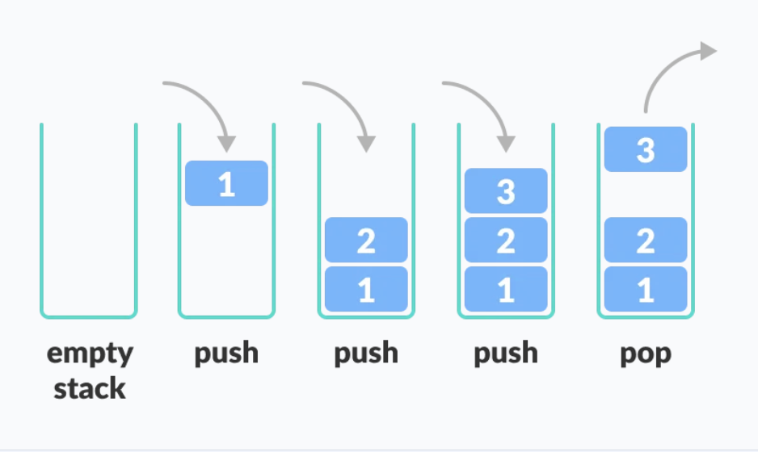

# **Stack (LIFO - Last in First Out)**
- It is a special type of list.
- The last element inserted in the stack is removed first.

- Think of this as a pile of plates on top of another:
    - You can put a plate on top `push()`
    - You can remove a plate from top `pop()`
    - If you want the plate which is at the bottom, you need to remove all the plates on top.

<p align="center">

</p>


</br>

## **Applications**

 - **General Applications**
    - To reverse a word:
        - Put all the letters in a stack and pop them out.
        - Because of the LIFO order of stack, you will get the letters in reverse order.

    - In compilers:
        - Compilers use the stack to calculate the value of expressions like 2 + 4 / 5 * (7 - 9) by converting the expression to prefix or postfix form.

    - In browsers:
        - The back button in a browser saves all the URLs you have visited previously in a stack.
        - Each time you visit a new page, it is added on top of the stack.
        - When you press the back button, the current URL is removed from the stack, and the previous URL is accessed.

</br>

- **Embedded System Applications**
    - Managing interrupt service routines (ISRs) in real-time operating systems (RTOS).
    - Saving and restoring the context of tasks in RTOS.
    - Storing the return address of a function in the call stack.
    - Implementing a stack-based Finite State Machine (FSM) for controlling the behavior of a system.
    - Managing the execution of a sequence of tasks in a microcontroller.

</br>

## **Asymptotic Analysis**
```
    ╔══════════════════════╦═══════╦══════╦══════╦══════════════════╗
    ║ Stack Implementation ║ Push  ║ Pop  ║ Peek ║ Space Complexity ║
    ╠══════════════════════╬═══════╬══════╬══════╬══════════════════╣
    ║ Array                ║ O(1)  ║ O(1) ║ O(1) ║ O(n)             ║
    ╠══════════════════════╬═══════╬══════╬══════╬══════════════════╣
    ║ Linked List          ║ O(1)  ║ O(1) ║ O(1) ║ O(n)             ║
    ╠══════════════════════╬═══════╬══════╬══════╬══════════════════╣
    ║ Deletion             ║ O(1)  ║ O(n) ║      ║                  ║
    ╚══════════════════════╩═══════╩══════╩══════╩══════════════════╝
```

</br>

## **Stack Implementation**

- ### **Initialize Stack**

    - We need to define the `STACK_SIZE` at the time of compilation to assign defined memeory to the program.
    - `top` is our variable which tracks the index of the array.

        ```C
            /*------Array Implementation--------*/
            #include <stdio.h>
            #define STACK_SIZE 10

            int stack_buffer[STACK_SIZE];
            int top = 0;

        ```

    </br>

    - `stack_buffer` is similar to `head` in a linked list.
    - But here it is a global variable so all the functions can access it and modify it.

        ```C
            /*------Linked List Implementation--------*/
            #include <stdio.h>
            #include <stdlib.h>

            struct stack_node
            {
                int data;
                struct stack_node *next;
            };
            struct stack_node *stack_buffer = NULL;
        ```
</br>

- ### **`push()`**
    - Here we assign the element to the current value of `top` and after assigning we will increment the value of `top` </br>
        Example:
        ```
            top = 4
            push(15)
                stack_buffer[4] = 15
                top = 5
        ```

        ```C
            /*------Array Implementation--------*/
            void push(int ele)
            {
                printf("\n Pushed element:  %d on top of the stack.\n", ele);
                stack_buffer[top++] = ele;
            }
        ```

    </br>

    - Assign memory of size `struct stack_node` so we can fill the `data` and `*next` memebers.
    - Assign memory to `data = ele`.
    - The `next` member should point to memory location stored in `stack_buffer` it will either be:
        - `NULL` or
        - `0x2000` some address.

    - `stack_buffer` will hold the memory address of `new_node` which has been created.

        ```C
            /*------Linked List Implementation--------*/
            void push(int ele)
            {
                struct stack_node *new_node = (struct stack_node *)malloc(sizeof(struct stack_node));
                if (new_node != NULL)
                {
                    new_node->data = ele;
                    new_node->next = stack_buffer;
                    stack_buffer = new_node;
                    printf("\n Pushed element:  %d on top of the stack.\n", ele);
                }
                else
                {
                    printf("\n ERROR: Memory allocation for new_node failed.\n");
                }
            }
        ```

</br>

- ### **`pop()`**
    - We first check if the stack is empty by checking if the array index `top > 0`
    - Only when it is NOT empty we can remove the element from the stack.
    - When we `push()` the element in we use `stack_buffer[top++]` which mean we are ahead by 1 position.
    - Now to `pop()` we need to go back by 1 array index done via `stack_buffer[--top]`
        ```C
            /*------Array Implementation--------*/
            int pop(void)
            {
                if(top > 0)         // If stack is NOT empty
                {
                    int tmp = top;
                    printf("\n Poped element:  %d from top of the stack.\n", stack_buffer[--tmp]);
                    return stack_buffer[--top];
                }
                else
                {
                    printf("\n ERROR: Stack is Empty, no element left to pop().\n");
                    return -1;
                }
            }
        ```


    </br>

    - We first check if the `head` of the linked list is pointing to some mem. addr. which means its is NOT empty.
    - To `pop()` the element from the linked list we need to:
        - The element to pop is what `stack_buffer` is pointing to.
        - To `pop()` it we need `stack_buffer` to point to what the element to remove is pointing to `stack_buffer = stack_buffer->next`

            ```C
                /*------Linked List Implementation--------*/
                int pop(void)
                {
                    if (stack_buffer != NULL)
                    {
                        struct stack_node *p = stack_buffer;
                        int ele = p->data;
                        stack_buffer = stack_buffer->next;
                        free(p);
                        printf("\n Poped element:  %d from top of the stack.\n", ele);
                        return ele;
                    }
                    else
                    {
                        printf("\n ERROR: The stack is empty NO elements left to pop().\n");
                        return -1;
                    }
                }
            ```